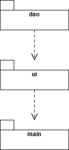
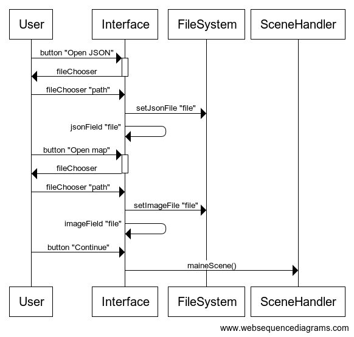
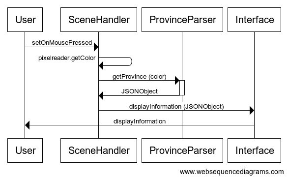
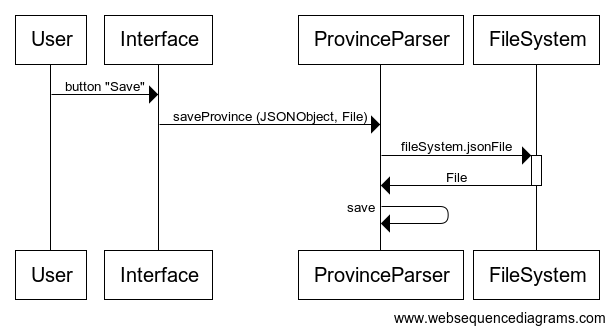
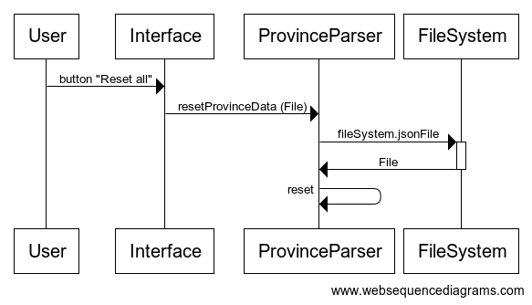

# Arkkitehtuurikuvaus

## Rakenne

Ohjelman pakkausrakenne on seuraavan kuvan kaltainen.

Pakkauksessa dao on tiedon tallennukseen ja sen hakemiseen liittyvät luokat, joita paketin ui luokat hyödyntävät piirtäessään käyttöliittymän main-luokalle näytettäväksi käyttäjälle.

## Käyttöliittymä

Käyttöliittymässä on kaksi osaa joista toinen on jaettu kahteen toiminnallisuuteen. Niiden kohdalla SceneHandler-luokka pitää huolen käyttöliittymän kasaamisesta ja sen metodeja startScene ja mainScene kutsuttaessa ohjelma voi vaihtaa näkymää niiden välillä.
Sovellusta käynnistäessä käyttöliittymän avulla käyttäjä valitsee aluksi tiedostoselaimella alustavat tiedostot hyödyntäen FileSystem-luokkaa, jonka tietoihin valitut tiedostopolut tallennetaan. Seuraavaksi ohjelman päänäkymässä oikean laidan tiedot haetaan käyttöliittymälle käyttäen ProvinceParser-luokkaa, jonka avulla JSON-tiedostosta luetaan olennaiset arvot getProvinces-metodilla. Käyttöliittymän vasemmalle puolelle piirretään valittu kuvatiedosto, josta hiirellä painettaessa annetaan väriarvo, jonka avulla haetaan dao-pakettia hyödyntäen sitä vastaavat arvot oikean puolen käyttöliittymälle.

## Tiedostojen hakeminen, muokkaus, tallennus ja nollaus.

### Tiedostot

Sovellus hyödyntää kahden tyyppisiä tiedostoja; tiedot olioista tallennetaan ja luetaan JSON-muotoisena JSON-tiedostoista ja se yksilöi oliot niiden RGB-arvojen perusteella, jotka visuaalisesti piirretään bmp-muotoisesta karttakuvasta.

### Hakeminen

Käyttäjällä mahdollisuus valita käytettävä tiedosto aluksi startScene-scenessä joka tarjoaa mahdollisuuden hakea halutut tiedostot, joko käyttöjärjestelmän tiedostoselaimen avulla tai syöttämällä itse polku jonka tiedosto tallennetaan FileSystem-luokalle. Myöhemmin Interface-luokka mahdollistaa tiedostojen vaihdon käytön aikana.

### Muokkaus

Käyttäjälle näyttöliittymä antaa mahdollisuuden muokata valitun provinssi-olion arvoja JavaFX:n TextField luokan kautta.

### Tallennus

Käyttäjä kutsuu Interface-luokan piirtämällä napilla ProvinceParser-luokan metodia saveProvinces, joka lukee aikaisemmin valitun tiedoston polun ja tallentaa sen uusiksi muokaten olion tietoja mikäli niitä oli muutettu.

### Nollaus

Käyttäjä kutsuu Interface-luokan piirtämällä napilla ProvinceParser-luokan metodia resetProvinces, joka puolestaan pyyhkii koko tiedoston tallentaen siihen pelkästään alustukseksi JSONArray-luokalle suljetut hakasulkeet.

## Päätoiminnallisuudet

Seuraavaksi kuvattuna käyttäjän toiminnallisuudet sekvenssikaavioina.

### Alkunäkymä

Kun kirjautumisnäkymän syötekenttiin kirjoitetetataan käyttäjätunnus ja salasana, jonka jälkeen klikataan painiketta _Login_, etenee sovelluksen kontrolli seuraavasti:

Alussa käyttäjälle tarjotaan käyttöliittymällä kolme toiminnallisuutta, ensin käyttäjä valitsee JSON-tiedoston jonka tiedot välitetään FileSystem-luokalle. Sen jälkeen valitaan kuvatiedosto jolle tehdään samoin sekä otetaan tiedosto talteen metodin omaksi muuttujaksi. Lopuksi käyttäjä jatkaa seuraavaan SceneHandlerin sceneen hydyntäen talteen otettua kuvatiedostoa.

### Päänäkymä - Tiedon haku tiedostosta

Käyttäjä valitsee hiiren painalluksella kuvasta värin, jonka arvot SceneHandler käsittelee ja pyytää ProvinceParserilta sitä vastaavan olion tiedot ja näyttää ne Interface-luokan kautta käyttäjälle.

### Päänäkymä - Tiedon tallennus tiedostoon

Painamalla tallennuspainiketta Interface-luokka lähettää käyttäjän muokkaamat tiedot ProvinceParserille joka pyytää FileSystemiltä polun tiedostoon ja sen jälkeen tallentaa siihen muokatut tiedot.

### Päänäkymä - Tiedoston nollaus

Painamalla resetpainiketta Interface lähettää pyynnön ProvinceParserille nollata tiedot, jonka jälkeen ProvinceParser hakee FileSystemiltä polun ja kutsuu omaa metodiaan nollata tiedot.
